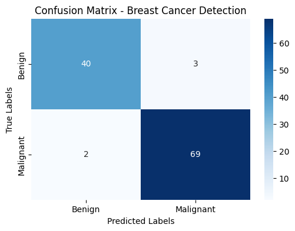

---

# Breast Cancer Detection using XGBoost Classifier 🎯


## 🔗 Live Demo

Access the live Streamlit app here:
👉 [Click to Launch Web App](https://breastcancerdetection-using-xgboost-classifier-jjxxgerkbhvtgip.streamlit.app/)

---

## 📌 Project Overview

This project aims to detect **breast cancer** using machine learning, specifically the **XGBoost classifier**. It uses the **Wisconsin Breast Cancer Dataset** and provides a web interface built using **Streamlit**, allowing users to input diagnostic features and predict whether the tumor is benign or malignant.

---

## 🧠 Technologies Used

* **Python**
* **Pandas**, **NumPy**, **Scikit-learn**
* **XGBoost**
* **Matplotlib**, **Seaborn** (for data visualization)
* **Streamlit** (for the web UI)

---

## 📊 Dataset

* **Name**: Breast Cancer Wisconsin (Diagnostic) Data Set
* **Source**: [UCI Machine Learning Repository](https://archive.ics.uci.edu/ml/datasets/Breast+Cancer+Wisconsin+%28Diagnostic%29)
* **Features**: 30 real-valued input features + diagnosis label (M = Malignant, B = Benign)

---

## 🚀 Features of the Web App

* Input interface for 30 diagnostic features
* Prediction of tumor type (Benign or Malignant)
* Model accuracy displayed
* Visualization of model performance using confusion matrix and classification report

---

## 🔧 How to Run Locally

1. **Clone the repository**

   ```bash
   git clone https://github.com/sounakss7/Breast_Cancer_detection-USING-XGBOOST-classifier.git
   cd Breast_Cancer_detection-USING-XGBOOST-classifier
   ```

2. **Install dependencies**
   It's recommended to use a virtual environment.

   ```bash
   pip install -r requirements.txt
   ```

3. **Run the Streamlit app**

   ```bash
   streamlit run app.py
   ```

---

## ✅ Model Performance

* **Classifier**: XGBoost
* **Accuracy**: \~98%
* **Evaluation**: Confusion matrix, precision, recall, F1-score

---

## 📂 Project Structure

```
├── app.py                     # Streamlit web app
├── model.pkl                  # Trained XGBoost model
├── data.csv                   # Dataset used
├── requirements.txt           # Python dependencies
├── breast_cancer_xgb.ipynb    # Training and analysis notebook
└── README.md                  # Project documentation
```

---

## 📸 Screenshots

### Confusion Matrix




---

## 📬 Contact

Created with ❤️ by [**Sounak**](https://github.com/sounakss7)
Feel free to reach out via GitHub for issues or suggestions.


